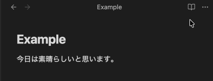
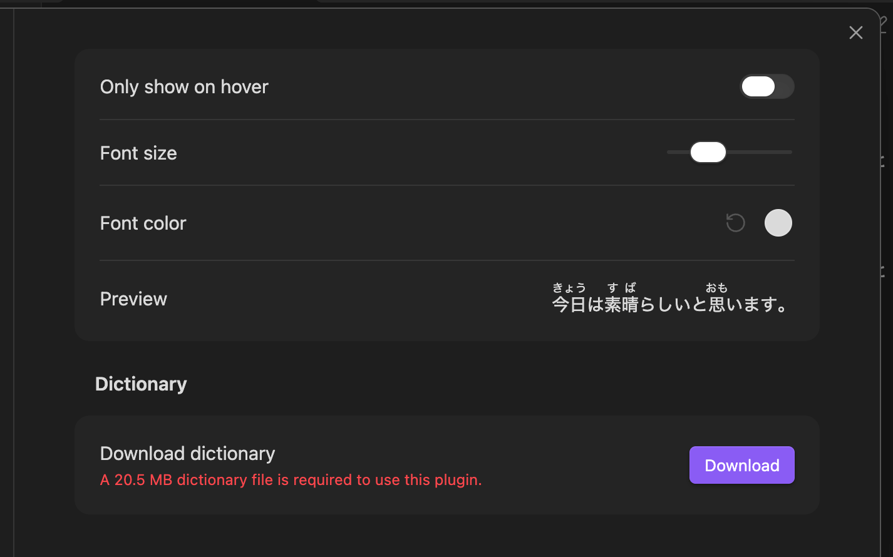

# Obsidian Furigana 

An [Obsidian](https://obsidian.md) plugin for **creating and displaying furigana** above Japanese kanji in reading view.

## Key Features
- **hover-only mode** for Japanese learners who want to challenge themselves.
- Adjustable font size and color

[Bugs, Issues, and Feature Requests](https://github.com/joepetrakovich/obsidian-lmstudio-connect/issues)

## How to use
1) After installing, navigate to the plugin settings and **download the required 20 MB dictionary files**.  
2) From settings, make any additional changes to the furigana's appearance and behavior.

## Related Tools
- [Subkit](https://chromewebstore.google.com/detail/subkit/nbfimkdbifhjfambljjggekodjlppiad): Learn languages via subtitles on apps like Netflix and YouTube.
- [Subkit Furigana Add-On](https://chromewebstore.google.com/detail/subkit-furigana-add-on/lamnjmadmgalhpnghcfaijbpkekgfaig?hl=en): Add this same furigana to video subtitles.
- [Poe Language Lens](https://get-poe.app): Display dictionary definitions, readings, sound clips, and more over any word in any app on Android (like Yomitan for mobile).
